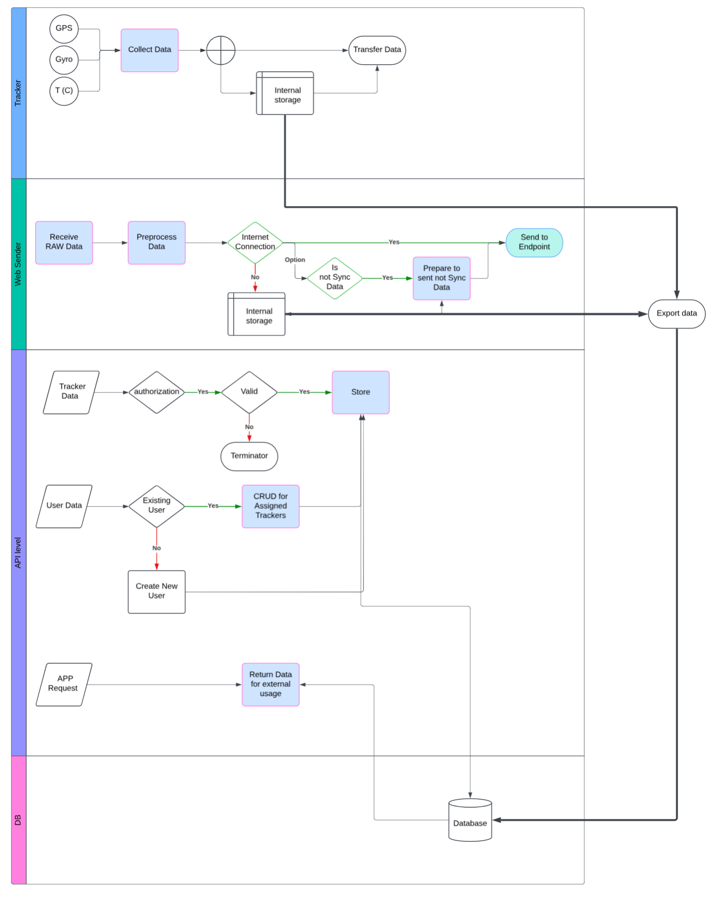

# NavigationProject
Navigation tracking Project

Initially POC built with Flet(Python) framework
Python implementation potentially will be changed to the Tauri (Rust)

# Structure:
* /data  - location of data that could be used as examole
* /devices_src - code for the devices that could be used in project
* /api_server - implementation of server side API 
* /web_server - implementation for the web service
* /main_app - implementation for the main app
* /historical - historical code for reference only

 DB used - Mongo DB

https://lucid.app/lucidchart/84775518-542d-40bd-9223-b9453e1d9e22/edit?viewport_loc=-1305%2C97%2C2528%2C1469%2C0_0&invitationId=inv_100c66d6-78ca-4148-adb6-4a0b88415512

Overall Backend idea:
